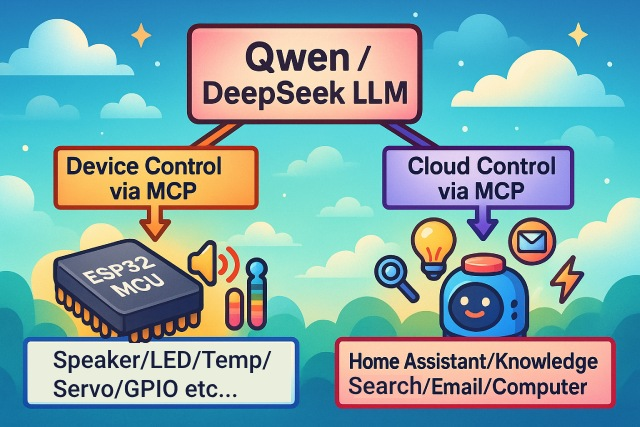
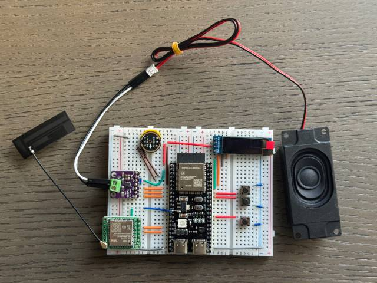
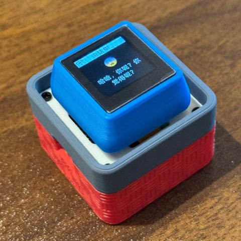

# An MCP-based Chatbot

（中文 | [English](README.md) | [日本語](README_ja.md)）

## Armour K08 四键板移植

本副本新增 ESP32-S3-WROOM-1-N16R8 的独立板型 `amour-k08-4keys`。完整引脚、按键、显示转换和验证说明见 [板型文档](main/boards/amour-k08-4keys/README.md)。首选 ESP-IDF 6.0.2，编译命令为：

```bash
source /path/to/esp-idf/export.sh
python3 scripts/build.py amour-k08-4keys --name amour-k08-4keys
```

2026-09-12 已使用 ESP-IDF 5.5.4 完成兼容性构建，canonical 命令返回成功；应用镜像为 2,819,392 字节，应用分区剩余 32%。可烧录镜像、SHA-256 校验值和构建日志见 [`firmware/amour-k08-4keys-idf5.5.4`](firmware/amour-k08-4keys-idf5.5.4/README.md)。首选的 ESP-IDF 6.0.2 构建仍待验证。

新增的[文字优先界面固件](firmware/amour-k08-4keys-text-ui-idf5.5.4/README.md)采用 24 px 状态栏和 216 px 对话区，多行换行、自动滚动，并在有文字时隐藏表情。已通过 ESP-IDF 5.5.4 构建及 67 项构建脚本测试，尚需实机验证。原固件包保留。

编译成功后，连接开发板并指定串口烧录（将 `/dev/ttyUSB0` 换成实际端口）：

```bash
idf.py -p /dev/ttyUSB0 flash monitor
```

烧录会改写开发板 flash，请先确认串口和目标设备。用户已完成当前版本初步实机测试：配网、对话、语音唤醒、屏幕方向与裁切、音量加减、模式键唤起及长按配网均正常；网络电台连续换台不会退出播放页。当前继续进行长时播放、网络恢复和跨功能回归测试。

## Fork 同步与功能分支合并

NAS 音乐与网络电台都属于同一份 K08 组合固件；推荐在各自功能分支开发，验证后再合并到自己的 Fork `main`。

功能完成后先在对应分支提交，例如：
```sh
git switch feature/k08-local-development
git status
git add services/nas-music README_zh.md firmware/
git commit -m "feat: add NAS music support"
```

### 首次配置原项目远端：只需执行一次

将“原作者仓库地址”替换为实际地址。本项目当前使用的示例是 `https://github.com/zhuhai-esp/ESP32-S3-AmourK08-4Keys.git`。

```sh
# 首次配置原项目远端：只需执行一次
git remote add upstream 原作者仓库地址

# 查看远端是否正确, `origin` 应指向你的 Fork，`upstream` 应指向原项目。
git remote -v

# 更新本地 main，使其与原项目主分支同步
git fetch upstream
git switch main
git merge --ff-only upstream/main

# 将功能分支合并到自己的 main,`--no-ff` 会留下清晰的功能合并节点。
git switch main
git merge --no-ff feature/k08-local-development -m "feat: merge K08 local development"
git push origin main # 推送到你的 Fork
```

当自己的 `main` 已有功能提交时，`--ff-only` 会因历史分叉而停止，这是预期行为。此后吸收原项目更新时使用普通合并：`git merge upstream/main`。若原项目默认分支是 `master`，将本文的 `upstream/main` 替换为 `upstream/master`。


出现冲突时，修改冲突文件后执行 `git add <文件>`、`git commit` 和 `git push origin main`。确认不再需要功能分支后，可执行 `git branch -d feature/k08-local-development` 删除本地分支。其他分支名称可通过 `git branch --show-current` 查询，并替换命令中的分支名。

## 美股与纳斯达克100行情工具

可选的 [美股 MCP 服务](services/us-stock-mcp/README.md) 在电脑上运行，通过 xiaozhi.me 的 MCP 接入点提供报价、自选股和走势分析，无需重新烧录。首版使用 QQQ ETF 作为纳斯达克100走势参考，不提供指数点位。支持明确标识的模拟模式；真实 Alpaca IEX 行情需自行配置 API 凭据。

## NAS 本地音乐库

[NAS 音乐 HTTP 服务](services/nas-music/README.md) 已部署在 DS923+ 的 `10.0.0.228:8090`，只读扫描 `/volume1/music` 中的 FLAC，并缓存为 K08 可播放的 Ogg Opus。2026-09-19 健康检查显示 344 首曲目均已就绪。设备端语音点歌、停止和屏幕播放状态代码已加入当前源码；可烧录文件见 [NAS 音乐固件包](firmware/amour-k08-4keys-nas-music-idf5.5.4/README.md)。

2026-09-20 已完成实机验证：官方后台调用 `self.music.play` 后，K08 能搜索 NAS、关闭遗留的官方语音通道并播放歌曲。NAS 服务使用 HTTP/1.1 持久连接；更新服务后须重新创建容器，不能只构建镜像。设备端兼容 keep-alive 响应的长度获取：读取到末尾的 TCP 关闭后，只要已收 JSON 可完整解析便继续使用；空响应、过大响应和格式错误仍会明确报错。`self.music.search` 可单独检索曲库；最新 NAS 服务会返回总匹配数，K08 会显示“共 N 首，前 5 首”，并将音乐文件的相对目录纳入检索，所以 `周杰伦/七里香/晴天.flac` 可用“周杰伦”或“周杰伦 晴天”找到。NAS 服务的 `/search` 已支持 `offset`，因此 NAS 音乐播放时长按 `+` 切下一首、长按 `-` 切上一首；它们会在当前点歌关键词的全部匹配中循环。长按判断直接读取应用层媒体状态，不会因 NAS 播放页的异步刷新被误判为待机。电台播放时两个长按仍切换电台，非媒体状态下仍分别为最大音量和静音。转码会清除 FLAC 标签与封面图，避免过大的 Ogg 标签包导致 K08 播放失败；此服务升级会自动重新转码缓存歌曲。播放 NAS 音乐时，K08 会从小智对话区切换到独立播放页，显示缓冲或播放状态、歌曲名、`DS923+ · 本地曲库` 与 `Ogg Opus · 局域网播放`；顶栏仍保留网络、电量和时间。歌名固定显示在标题卡片中，过长时裁切，不做滚动。模式键停止、播放结束、失败或切换到网络电台时会自动回到小智界面。播放中短按模式键会立即停止音乐并回到待机；下一次短按会等音乐连接关闭后再进入对话，避免界面停留在“连接中”。语音唤醒打断音乐仍待后续验证。

## K08 直连网络电台

2026-09-19 第一版已编译并烧录到 K08：设备直接连接电台 HTTP MP3 流并在本机解码、播放，不使用 NAS 或 Docker。第二阶段将目录扩充为 31 个音乐、经典、怀旧、流行、粤语和国际音乐节目，包括清晨音乐台、浙江音乐调频、上海经典947、北京音乐广播、上海动感101、广东音乐之声、深圳飞扬971、Easy FM、中国校园之声和亚洲音乐台。

小智会话中可用的设备端 MCP 工具为 `self.radio.play`（参数 `station`）、`self.radio.search`（参数 `query`）、`self.radio.random`（可选参数 `category`）、`self.radio.next`、`self.radio.previous`、`self.radio.stop` 与 `self.radio.status`。烧录后请结束当前会话，再重新唤醒小智，使后台重新获取工具列表。角色设定可加入：

```text
用户要求播放、切换、停止或查询网络电台时，优先调用 self.radio.play、
self.radio.search、self.radio.random、self.radio.next、self.radio.previous、self.radio.stop 或 self.radio.status。
播放电台时 station 必须使用预置目录中的电台名称；工具返回错误时如实说明。
用户说“随便放一台”时调用 self.radio.random，category 留空；说“随便放一个粤语、经典、
怀旧或国际音乐电台”时，category 填对应分类。
用户要求收藏、取消收藏、查看收藏或播放收藏台时，分别调用 self.radio.favorite_add、
self.radio.favorite_remove、self.radio.favorite_list、self.radio.favorite_play。收藏保存在 K08，
重启后仍保留；播放收藏台时 station 可留空。
用户说“停止电台”“关掉电台”“停止播放”“暂停”或“不要听了”时，必须调用
self.radio.stop；若选择 self.music.stop，它同样会停止正在播放的网络电台，不能只用文字回复。
```

首版仅接受直接返回音频数据的明文 HTTP MP3 流；不支持 HTTPS、M3U/M3U8、HLS、AAC、需要跳转的链接或任意 URL。短按模式键、语音唤醒和 `self.radio.stop` 都会停止电台；停止请求的 HTTP 读取超时设为 1 秒。首次实机验证优先说“播放上海动感101”，再测试“下一台”“停止电台”和模式键停止。

播放网络电台时，K08 会覆盖小智对话区并显示独立播放页：直播状态、当前电台名称、节目分类、预置目录序号与收藏状态，以及“上一台 / 下一台 / 模式键停止”的操作提示。顶栏的网络、电量和时间仍可见。播放区按状态、直播标记、标题卡片、分类与序号、操作提示五层排布；电台名经 1.125 倍放大并置于独立卡片，所有预置台名静态居中显示、不循环滚动，次级信息使用较低亮度，避免文字重叠且建立清晰层级。操作提示收为单行，位于分隔线下方，扩大与“预置”信息的间距。连接成功后状态由“正在连接”切换为“正在播放”；“网络直播 · 电台”使用弱化的普通文字色，避免主题绿色过亮。收藏或取消收藏当前电台时，播放页会立即刷新收藏状态。播放或连接电台时，音量加键长按切换下一台，音量减键长按切换上一台；非电台状态下，两个长按仍分别为最大音量和静音，短按始终保持音量加减。短按模式键停止电台。停止、播放失败或切到其他媒体时自动恢复原小智对话界面。直播流没有可靠的曲目、封面或进度信息，因此播放页不显示这些内容。

切台使用播放器代次和播放页会话代次双重校验。连续长按切台时，旧 HTTP 流晚到的停止或失败回调会被忽略，不能结束新电台的播放会话或使界面退回待命。

直播源在已经开始播放后关闭 HTTP 连接时，K08 会显示“正在连接”并自动重连，而不是将其当作歌曲播放结束并退出电台播放页。

2026-09-20 用户完成当前版本初步实机测试：电台连续换台不会退出播放页，模式键停止正常。后续继续进行至少 10 个电台的长时播放、反复切台、Wi-Fi 断线恢复、语音停止/唤醒打断，以及普通对话、NAS 音乐和纳斯达克100 MCP 的回归测试。语音“停止电台”首次没有选择设备工具，已加强 `self.radio.stop` 与兼容的 `self.music.stop` 的工具说明和角色设定提示；重新烧录、结束当前会话后再验证。

## 待命表情

K08 的文字优先对话界面会在有消息时隐藏表情，保证内容区域完整。待命且无消息时，默认显示资源包中的 128×128 彩色 `neutral` 表情；K08 的默认表情资源已从 `noto-color-emoji_64` 切换为 `noto-color-emoji_128`。资源缺失时会回退到原有的 30px 机器人图标。

## 介绍

👉 [人类：给 AI 装摄像头 vs AI：当场发现主人三天没洗头【bilibili】](https://www.bilibili.com/video/BV1bpjgzKEhd/)

👉 [手工打造你的 AI 女友，新手入门教程【bilibili】](https://www.bilibili.com/video/BV1XnmFYLEJN/)

小智 AI 聊天机器人作为一个语音交互入口，利用 Qwen / DeepSeek 等大模型的 AI 能力，通过 MCP 协议实现多端控制。



## 近期更新

- 项目主线现已迁移到 ESP-IDF v6.0 或以上版本，首选稳定版为 v6.0.2；此前的 157 个发布变体已在 ESP-IDF v6.0.1 上通过构建验证。当前矩阵包含 171 个变体，其中 170 个支持 IDF 6.0.x，ESP32-S31 变体需要 IDF 6.1 或以上版本。
- MQTT 和 BluFi 加密已迁移到 PSA Crypto，同时完成了 IDF 6 组件拆分及第三方依赖兼容处理。
- 加固了音频流水线并发、MQTT/UDP 数据包校验和发布矩阵选择逻辑。
- ESP-IDF v5.5 仅保留用于文档明确标注的旧版板卡；使用 ESP-SR 2.4.7 时，ESP32-P4 Rev1 和 Rev3 均支持 IDF 6。完整兼容性和板卡验证状态请参阅 [ESP-IDF 6.0 迁移文档](docs/esp-idf-6-migration.md)。

### 已实现功能

- 支持 Wi-Fi、有线以太网、USB RNDIS，以及 ML307/EC801E 或 NT26 Cat.1 4G 网络；部分硬件支持 Wi-Fi 与 4G 切换
- 基于 [ESP-SR](https://github.com/espressif/esp-sr) 的离线语音唤醒，支持自定义唤醒词
- 支持两种通信传输方式：[WebSocket](docs/websocket_zh.md) 和 [MQTT + UDP](docs/mqtt-udp_zh.md)
- 采用 Opus 音频流，既支持传统的流式 ASR + LLM + TTS 方案，也支持 Realtime 端到端语音模型；具备 AEC 的硬件可实现实时全双工交互
- 声纹识别，识别当前说话人的身份 [3D Speaker](https://github.com/modelscope/3D-Speaker)
- OLED / LCD 显示屏，支持表情和丰富的情绪呈现；部分硬件支持摄像头视觉输入
- 电量显示与电源管理
- 提供 38 种界面语言；语音提示优先使用本地化资源，缺失时自动回退到英文
- 支持 ESP32、ESP32-C3、ESP32-C5、ESP32-C6、ESP32-S3、ESP32-P4 芯片平台
- 支持热点和 BluFi 两种 Wi-Fi 配网方式
- 通过设备端 MCP 实现设备控制（音量、灯光、电机、GPIO 等）
- 通过云端 MCP 扩展大模型能力（智能家居控制、PC桌面操作、知识搜索、邮件收发等）
- 自定义唤醒词、字体、表情与聊天背景，支持网页端在线修改 ([自定义Assets生成器](https://github.com/78/xiaozhi-assets-generator))

## 硬件

### 面包板手工制作实践

详见飞书文档教程：

👉 [《小智 AI 聊天机器人百科全书》](https://ccnphfhqs21z.feishu.cn/wiki/F5krwD16viZoF0kKkvDcrZNYnhb?from=from_copylink)

面包板效果图如下：



### 支持 138 个板卡目录、171 个固件发布变体（仅展示部分）

- <a href="https://oshwhub.com/li-chuang-kai-fa-ban/li-chuang-shi-zhan-pai-esp32-s3-kai-fa-ban" target="_blank" title="立创·实战派 ESP32-S3 开发板">立创·实战派 ESP32-S3 开发板</a>
- <a href="https://github.com/espressif/esp-box" target="_blank" title="乐鑫 ESP32-S3-BOX-3">乐鑫 ESP32-S3-BOX-3</a>
- <a href="https://docs.m5stack.com/zh_CN/core/CoreS3" target="_blank" title="M5Stack CoreS3">M5Stack CoreS3</a>
- <a href="https://docs.m5stack.com/en/atom/Atomic%20Echo%20Base" target="_blank" title="AtomS3R + Echo Base">M5Stack AtomS3R + Echo Base</a>
- <a href="https://gf.bilibili.com/item/detail/1108782064" target="_blank" title="神奇按钮 2.4">神奇按钮 2.4</a>
- <a href="https://www.waveshare.net/shop/ESP32-S3-Touch-AMOLED-1.8.htm" target="_blank" title="微雪电子 ESP32-S3-Touch-AMOLED-1.8">微雪电子 ESP32-S3-Touch-AMOLED-1.8</a>
- <a href="https://github.com/Xinyuan-LilyGO/T-Circle-S3" target="_blank" title="LILYGO T-Circle-S3">LILYGO T-Circle-S3</a>
- <a href="https://oshwhub.com/tenclass01/xmini_c3" target="_blank" title="虾哥 Mini C3">虾哥 Mini C3</a>
- <a href="https://oshwhub.com/movecall/cuican-ai-pendant-lights-up-y" target="_blank" title="Movecall CuiCan ESP32S3">璀璨·AI 吊坠</a>
- <a href="https://github.com/WMnologo/xingzhi-ai" target="_blank" title="无名科技Nologo-星智-1.54">无名科技 Nologo-星智-1.54TFT</a>
- <a href="https://www.seeedstudio.com/SenseCAP-Watcher-W1-A-p-5979.html" target="_blank" title="SenseCAP Watcher">SenseCAP Watcher</a>
- <a href="https://www.bilibili.com/video/BV1BHJtz6E2S/" target="_blank" title="ESP-HI 超低成本机器狗">ESP-HI 超低成本机器狗</a>

<div style="display: flex; justify-content: space-between;">
  <a href="docs/v1/lichuang-s3.jpg" target="_blank" title="立创·实战派 ESP32-S3 开发板">
    
  </a>
  <a href="docs/v1/espbox3.jpg" target="_blank" title="乐鑫 ESP32-S3-BOX3">
    
  </a>
  <a href="docs/v1/m5cores3.jpg" target="_blank" title="M5Stack CoreS3">
    
  </a>
  <a href="docs/v1/atoms3r.jpg" target="_blank" title="AtomS3R + Echo Base">
    
  </a>
  <a href="docs/v1/magiclick.jpg" target="_blank" title="神奇按钮 2.4">
    
  </a>
  <a href="docs/v1/waveshare.jpg" target="_blank" title="微雪电子 ESP32-S3-Touch-AMOLED-1.8">
    
  </a>
  <a href="docs/v1/lilygo-t-circle-s3.jpg" target="_blank" title="LILYGO T-Circle-S3">
    
  </a>
  <a href="docs/v1/xmini-c3.jpg" target="_blank" title="虾哥 Mini C3">
    
  </a>
  <a href="docs/v1/movecall-cuican-esp32s3.jpg" target="_blank" title="CuiCan">
    
  </a>
  <a href="docs/v1/wmnologo_xingzhi_1.54.jpg" target="_blank" title="无名科技Nologo-星智-1.54">
    
  </a>
  <a href="docs/v1/sensecap_watcher.jpg" target="_blank" title="SenseCAP Watcher">
    
  </a>
  <a href="docs/v1/esp-hi.jpg" target="_blank" title="ESP-HI 超低成本机器狗">
    
  </a>
</div>

## 软件

### 固件烧录

新手第一次操作建议先不要搭建开发环境，直接使用免开发环境烧录的固件。

固件默认接入 [xiaozhi.me](https://xiaozhi.me) 官方服务器，个人用户注册账号可以免费使用 Qwen 实时模型。

👉 [新手烧录固件教程](https://ccnphfhqs21z.feishu.cn/wiki/Zpz4wXBtdimBrLk25WdcXzxcnNS)

### 开发环境

- Cursor 或 VSCode
- 安装 ESP-IDF 插件，首选 [ESP-IDF v6.0.2](https://github.com/espressif/esp-idf/releases/tag/v6.0.2)，建议使用 v6.0 或以上的稳定版本；ESP-IDF v5.5.2 仅保留用于旧版硬件兼容
- Linux 比 Windows 更好，编译速度快，也免去驱动问题的困扰
- 本项目使用 Google C++ 代码风格，提交代码时请确保符合规范

### 开发者文档

- [ESP-IDF 6.0 迁移文档](docs/esp-idf-6-migration.md) - SDK 兼容性、组件变更、旧版硬件支持和板卡验证状态
- [自定义开发板指南](docs/custom-board_zh.md) - 学习如何为小智 AI 创建自定义开发板
- [MCP 协议物联网控制用法说明](docs/mcp-usage_zh.md) - 了解如何通过 MCP 协议控制物联网设备
- [MCP 协议交互流程](docs/mcp-protocol_zh.md) - 设备端 MCP 协议的实现方式
- [MQTT + UDP 混合通信协议文档](docs/mqtt-udp_zh.md)
- [一份详细的 WebSocket 通信协议文档](docs/websocket_zh.md)

## 大模型配置

如果你已经拥有一个小智 AI 聊天机器人设备，并且已接入官方服务器，可以登录 [xiaozhi.me](https://xiaozhi.me) 控制台进行配置。

👉 [后台操作视频教程（旧版界面）](https://www.bilibili.com/video/BV1jUCUY2EKM/)

## 相关开源项目

在个人电脑上部署服务器，可以参考以下第三方开源的项目：

- [xinnan-tech/xiaozhi-esp32-server](https://github.com/xinnan-tech/xiaozhi-esp32-server) Python 服务器
- [joey-zhou/xiaozhi-esp32-server-java](https://github.com/joey-zhou/xiaozhi-esp32-server-java) Java 服务器
- [AnimeAIChat/xiaozhi-server-go](https://github.com/AnimeAIChat/xiaozhi-server-go) Golang 服务器
- [hackers365/xiaozhi-esp32-server-golang](https://github.com/hackers365/xiaozhi-esp32-server-golang) Golang 服务器

使用小智通信协议的第三方客户端项目：

- [huangjunsen0406/py-xiaozhi](https://github.com/huangjunsen0406/py-xiaozhi) Python 客户端
- [TOM88812/xiaozhi-android-client](https://github.com/TOM88812/xiaozhi-android-client) Android 客户端
- [100askTeam/xiaozhi-linux](http://github.com/100askTeam/xiaozhi-linux) 百问科技提供的 Linux 客户端
- [78/xiaozhi-sf32](https://github.com/78/xiaozhi-sf32) 思澈科技的蓝牙芯片固件
- [QuecPython/solution-xiaozhiAI](https://github.com/QuecPython/solution-xiaozhiAI) 移远提供的 QuecPython 固件

## 关于项目

这是一个由虾哥开源的 ESP32 项目，以 MIT 许可证发布，允许任何人免费使用，修改或用于商业用途。

我们希望通过这个项目，能够帮助大家了解 AI 硬件开发，将当下飞速发展的大语言模型应用到实际的硬件设备中。

如果你有任何想法或建议，请随时提出 Issues 或加入 [Discord](https://discord.gg/C759fGMBcZ) 或 QQ 群：1011329060

## Star History

<a href="https://star-history.com/#78/xiaozhi-esp32&Date">
 <picture>
   <source media="(prefers-color-scheme: dark)" srcset="https://api.star-history.com/svg?repos=78/xiaozhi-esp32&type=Date&theme=dark" />
   <source media="(prefers-color-scheme: light)" srcset="https://api.star-history.com/svg?repos=78/xiaozhi-esp32&type=Date" />
   
 </picture>
</a>
